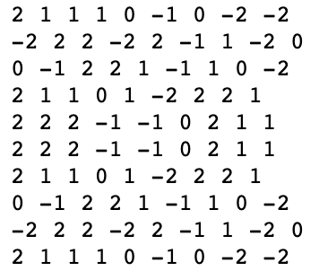
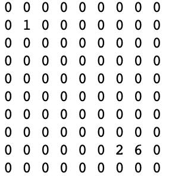

# Jintori GAME

## directory structure
```
├── README.md
├── api-src
│   └── api-jintori.py
├── docker
│   ├── Dockerfile
│   └── memo.txt
├── other
│   ├── pointfield.png
│   └── userfield.png
├── rule-jintori.txt
└── server-field
    ├── jintori-field.go
    └── memo.txt
```

## docker
### how to build
see 'docker/memo.txt' .

### how to use "jintori-field.go"
run a command in a running container
> docker exec -it [container name] bash

put "jintori-field.go" in working directory of your container, and you can run it and build local server
> go run jintori-field.go

if it starts properly, "Start Go HTTP Server (port number is ---)" is displayed


## api-src
in this src, each direction is expressed by number
| number | direction |
----|---- 
| 0 | upper left |
| 1 | up |
| 2 | upper right |
| 3 | left |
| 4 | stay |
| 5 | right |
| 6 | lower left |
| 7 | down |
| 8 | lower right|

### how to use
#### first, install "requests" (python3 library)
> pip3 install requests

#### write the following at the beginning of the source code
> from game_api import jinGameAPI

#### creates a new instance of the class and assigns this object to the local variable "game" (example:container port is 8000)
> game = jinGameAPI(8000)

#### start the game
> game._start()

returns "turn,(length,width),pointfield" (turn is game turns (int), (length,width) is field length and width (tupple), pointfield is field with point)

#### move usr (example: usr is 1 and usr moves right)
> game._move(1,5)

#### remove the panel (example:usr is 1 and usr removes upper right)
> game._remove(1,2)

#### you can get the field
> game._getField()

(the fields that can be get are "point field" and "user field", where "point field" is field with point and "user field" is field with usr location)

#### point field

#### user field


#### you can get usr position (example: usr is 1)
> game._getPosition(1)
>> out: [2, 1]  

returns "[x(column), y(row)]" (by list)

#### you can calculate score
> game._calcPoint()  
>> out: [0,1,1,2,3,5]  

returns "[tile point (usr 1), field point (usr 1), total point (usr 1), tile point (usr 2), field point (usr 2), total point (usr 2)]" (by list)

#### you can judge the direction(example: usr is 1 and usr moves right)
> game._judgeDirection(1,5)
>> out: 1

returns "1", "2", "3" or "4" (by str). 
| number | code | means |
----|---- | ----
| 1 | Error | out of field |
| 2 | is_panel | there is a panel |
| 3 | is_user | there is an usr |
| 4 | ok | no problem |

#### you can change field point
> game._changeField()
